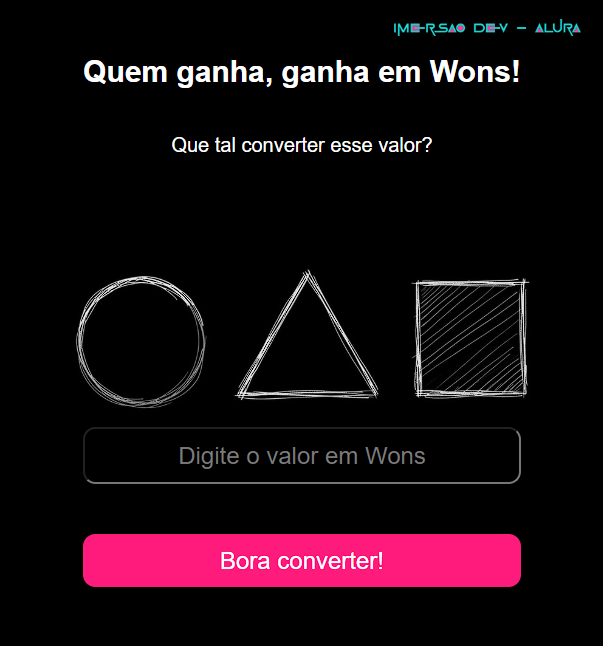

# Conversor de Moeda - Wons para Reais

**##Sobre o Projeto**

Este é um conversor de moeda que permite aos usuários converter valores de Wons sul-coreanos (KRW) para Reais brasileiros (BRL). O projeto foi desenvolvido como parte da Imersão DEV da Alura 2025. o projeto foi implementado para capturar e retornar valores de inputs com JavaScript.

 Funcionalidade

* O usuário insere um valor em Wons.
* O sistema converte o valor com base na taxa de conversão fixa.
* O resultado da conversão é exibido na tela.
* Caso um valor inválido seja inserido, uma mensagem de erro é exibida.

️ Tecnologias Utilizadas

* HTML5: Estrutura da página.
* CSS3: Estilização e responsividade.
* JavaScript: Implementação da lógica de conversão.

 Estrutura do Projeto